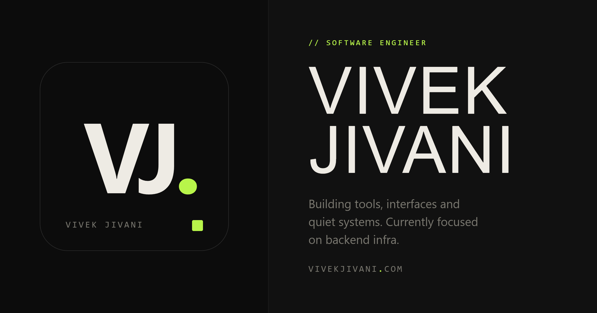

  

Full Stack Engineer & Architect &nbsp;·&nbsp; Surat, India 🇮🇳

 

<em>I build things that <strong>actually work</strong> — end-to-end products from design to deployment, across web and mobile.</em>

 

&nbsp;
&nbsp;

---

## 🧑‍💻 About Me

<table>
  <tr>
    <td width="50%" valign="top">
      🏗️ &nbsp;<strong>6+ years</strong> shipping production apps — from B2B diamond trading platforms to cloud-native data automation tools
    </td>
    <td width="50%" valign="top">
      📱 &nbsp;Comfortable across <strong>Flutter mobile</strong> and <strong>Next.js / React web</strong> — one engineer, full product
    </td>
  </tr>
  <tr>
    <td valign="top">
      🤖 &nbsp;AI-powered workflow — I use <strong>Claude &amp; Gemini</strong> daily for architecture, code review, and debugging
    </td>
    <td valign="top">
      🚀 &nbsp;Last big win: architected a serverless platform that delivered a <strong>70% productivity boost</strong> at Nexsales
    </td>
  </tr>
</table>

---

## 🛠️ Tech Stack

**📱 Mobile**

**🌐 Frontend**

**⚙️ Backend**

**🗄️ Databases**

**☁️ DevOps & Cloud**

**🤖 AI Tools**

---

## 🚀 Featured Projects

<table>
  <tr>
    <td width="50%" valign="top">
      <h3>⚡ Goldmine</h3>
      <em>Data Automation Platform</em>
        
      Serverless data automation platform that achieved a <strong>70% productivity boost</strong> and <strong>60% cost reduction</strong> through containerized microservices and intelligent workflow orchestration.
        
      <code>Node.js</code> <code>Docker</code> <code>Serverless</code> <code>PostgreSQL</code>
    </td>
    <td width="50%" valign="top">
      <h3>💎 Craft Diamonds</h3>
      <em>Flutter · iOS & Android</em>
        
      B2B diamond trading platform — real-time inventory browsing and order management for gem traders on the go.
        
      <code>Flutter</code> <code>Firebase</code> <code>Node.js</code> <code>B2B</code>
        
      <a href="https://play.google.com/store/apps/details?id=co.craftdiamonds.app">▶ Play Store</a>
    </td>
  </tr>
  <tr>
    <td width="50%" valign="top">
      <h3>📞 VoiceReach Dialer</h3>
      <em>Cloud Sales Platform</em>
        
      Cloud-native sales dialer — contributed core features and led Docker-based containerization strategy for scale.
        
      <code>Node.js</code> <code>Docker</code> <code>GCP</code> <code>REST API</code>
        
      <a href="https://voicereach.us">🌐 Live</a>
    </td>
    <td width="50%" valign="top">
      <h3>🧾 GST Tools</h3>
      <em>Flutter · Tax Utility App</em>
        
      Handy GST calculation and filing utility for Indian businesses — offline-first approach, fast lookups, and a clean UI that simplifies tax compliance.
        
      <code>Flutter</code> <code>Firebase</code> <code>Offline-first</code>
        
      <a href="https://play.google.com/store/apps/details?id=in.codetailor.gstutils">▶ Play Store</a>
    </td>
  </tr>
  <tr>
    <td width="50%" valign="top">
      <h3>🌸 Reiki Surat</h3>
      <em>Freelance · Wellness Center Website</em>
        
      Professional website for a wellness and healing center — calming design, service listings, and an easy appointment contact flow.
        
      <code>HTML/CSS</code> <code>JavaScript</code>
        
      <a href="https://reikisurat.in">🌐 Live</a>
    </td>
    <td width="50%" valign="top">
      <h3>🦷 Varni Dental Care</h3>
      <em>Freelance · Dental Clinic Website</em>
        
      Clean, trustworthy website for a dental clinic — service showcase, patient-friendly UX, and a local SEO-ready structure.
        
      <code>HTML/CSS</code> <code>JavaScript</code>
        
      <a href="https://varnidentalcare.in">🌐 Live</a>
    </td>
  </tr>
</table>

---

## 📊 GitHub Stats

---

## 🤝 Let's Work Together

<table>
  <tr>
    <td align="center" width="33%">
      🌐
       
      <strong>Portfolio</strong>
       
      <a href="https://vivekjivani.com">vivekjivani.com</a>
    </td>
    <td align="center" width="33%">
      💼
       
      <strong>LinkedIn</strong>
       
      <a href="https://linkedin.com/in/viekjivani">in/viekjivani</a>
    </td>
    <td align="center" width="33%">
      📧
       
      <strong>Email</strong>
       
      <a href="mailto:vivekjivani17@gmail.com">vivekjivani17@gmail.com</a>
    </td>
  </tr>
</table>

 

*Open to **freelance projects** and **full-time roles** — remote worldwide 🌍*

 

⚡ Powered by coffee, curiosity, and a solid Wi-Fi connection

